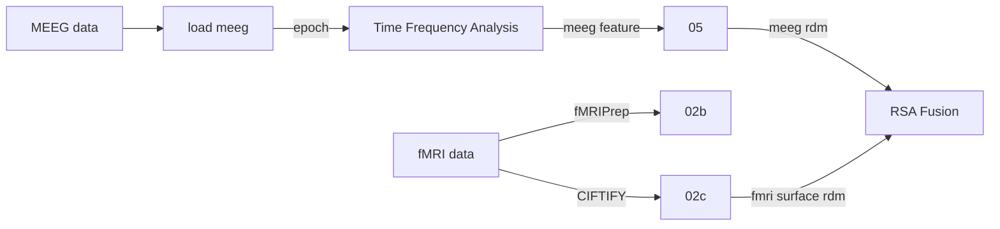
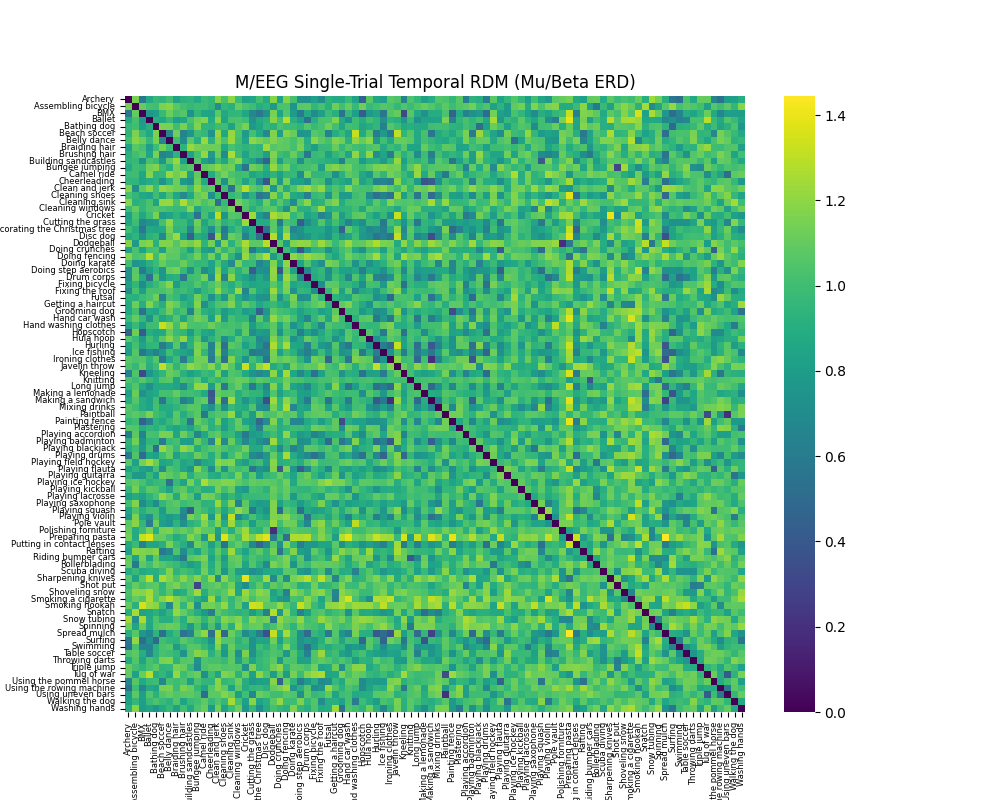
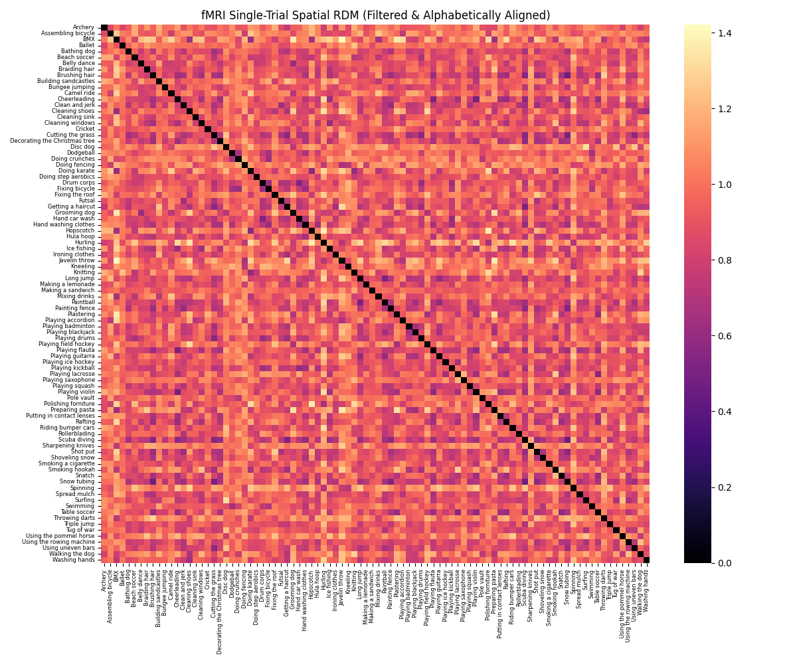
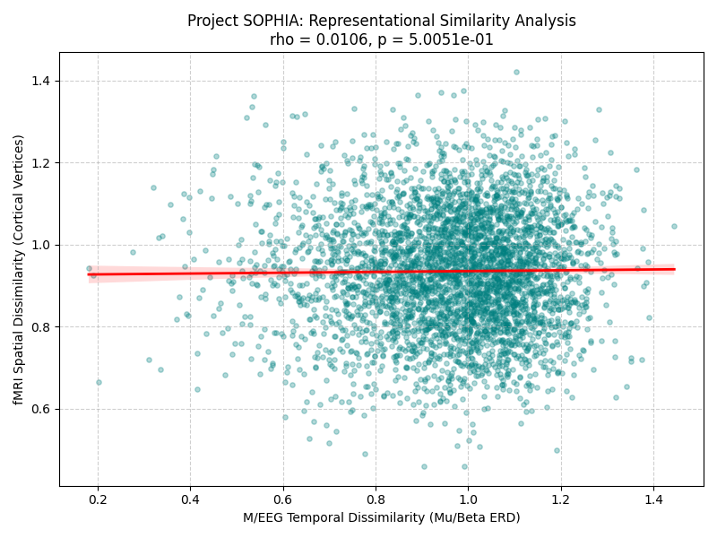

S.O.P.H.I.A.---Spatiotemporal-Optimization-Package-for-Heterogeneous-Imaging-Alignment
---
**Author**: Isaac Dean Huang

 Overview
---
As researchers, we are constantly forced to choose between the spatial
resolution of fMRI—which tells us where things happen—and the temporal
resolution of M/EEG—which tells us when things happen. This pipeline is
explicitly built to bypass that trade-off.

Existing toolboxes handle volumetric fMRI and standard sensor-space EEG. My package would like to be the first standardized pipeline for surface-based fMRI-to-MEEG-frequency representational fusion.

 Datasets 
---
A large-scale fMRI dataset for human action recognition  
https://openneuro.org/datasets/ds004488/versions/2.0.1  

HAD-MEEG  
https://openneuro.org/datasets/ds007353/versions/1.0.0

  Respository Structure
 ---
| Code | Descrpition |  
| :--- | :---: |  
| `01_load_meeg.py` | Preprocesses M/EEG data, handles signal filtering, and performs epoch slicing. |  
| `02_load_fmri.py` | Initial fMRI spatial prototyping and General Linear Model (GLM) processing. |  
| `02b_fmri_multirun.py` | Processes multirun fMRI data using the fMRIPrep standard to generate averaged 3D maps and fMRI RDMs. |  
| `02c_load_fmri_surface.py` | Ingests CIFTIFY fMRI surface data to prepare for final RSA fusion. |  
| `03_time_frequency.py` | Conducts time-frequency domain analysis on evoked M/EEG data to extract signal features.  |  
| `04_source_localization.py` | Performs M/EEG source localization utilizing the fsaverage anatomy model. |  
| `05_machine_learning.py` | Extracts final M/EEG features and generates the M/EEG Representational Dissimilarity Matrix (RDM). |  
| `06_rsa_fusion.py` | Executes Representational Similarity Analysis (RSA) to effectively fuse the M/EEG and fMRI RDMs. |  
| `check_overlap.py` | Utility script to verify subject and trial overlaps across multimodal datasets. |  
| `sanity_check.py` | Initial data validation tool to confirm epoch slicing and event labels. |  

 Pipeline
--- 

  Results Showcase
 ---
To visualize the representational geometries extracted from both modalities and their final integration, below are the generated Dissimilarity Matrices and the spatial-temporal RSA fusion output.

  
  

  <em><b>Left:</b> M/EEG RDM (Extracted from time-frequency domain features). <b>Right:</b> fMRI RDM (Derived from averaged 3D surface maps).</em>

 

**RSA Fusion Result** *The final alignment bridging fMRI spatial data and M/EEG temporal data.*

  Current status and milestone
---
 Completed:  
 BIDS dataset ingestion, M/EEG signal filtering and epoch slicing, fMRI integration with standard fMRIPrep preprocessed data, source localization, fMRI & M/EEG RDM generation, and baseline RSA fusion.

 On Hold:  
 Support Vector Machine (SVM) and independent Machine Learning classification steps are temporarily bypassed to prioritize the core RSA fusion math.
 
 Future Work
---
 1.final rsa math validation with python rsatoolbox  
 2.larger sample size
 3.meeg rdm calculation weighting
 4.packaging  
 5.testing    

 

 Reference
---
Esteban, O., Markiewicz, C.J., Blair, R.W. et al. fMRIPrep: a robust preprocessing pipeline for functional MRI. Nat Methods 16, 111–116 (2019). https://doi.org/10.1038/s41592-018-0235-4
