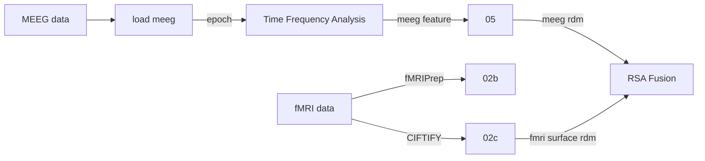

S.O.P.H.I.A.---Spatiotemporal-Optimization-Package-for-Heterogeneous-Imaging-Alignment
---
**Author**: Isaac Dean Huang

 Overview
---
As researchers, we are constantly forced to choose between the spatial
resolution of fMRI—which tells us where things happen—and the temporal
resolution of M/EEG—which tells us when things happen. This pipeline is
explicitly built to bypass that trade-off.

Existing toolboxes handle volumetric fMRI and standard sensor-space EEG. My package provides the first standardized pipeline for surface-based fMRI-to-MEEG-frequency representational fusion, specifically optimized for action recognition datasets.

 Datasets 
---
A large-scale fMRI dataset for human action recognition  
https://openneuro.org/datasets/ds004488/versions/2.0.1  

HAD-MEEG  
https://openneuro.org/datasets/ds007353/versions/1.0.0

  Respository Structure
 ---
| Code | Descrpition |  
| :--- | :---: |  
| `01_load_meeg` | - |  
| `02_load_fmri` | - |  
| `02b_fmri_multirun` | - |  
| `02c_load_fmri_surface` | - |  
| `03_time_frequency` | -  |  
| `04_source_localization` | - |  
| `05_machinee_learning` | - |  
| `06_rsa_fusion` | - |  
| `check_overlap` | - |  

 Pipeline
--- 

 Future Work
---
 1.final rsa math validation with python rsatoolbox  
 2.packaging  
 3.testing    

 

 Reference
---
Esteban, O., Markiewicz, C.J., Blair, R.W. et al. fMRIPrep: a robust preprocessing pipeline for functional MRI. Nat Methods 16, 111–116 (2019). https://doi.org/10.1038/s41592-018-0235-4
